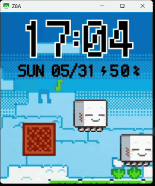

# 探索无限 (Explore Infinity)

> 小天才 Z8A 手表表盘 — Minecraft 乐魂主题

基于小天才主题商店"MC乐魂"形象表盘逆向分析，从零复现的 `clockType=10` (WallpaperService) 表盘。视觉效果不错，完整还原了乐魂风格的数字和布局。

  

## 声明

- **仅用于学习交流和技术参考**
- 所有代码为独立编写，基于对小天才表盘框架的逆向分析
- 不包含原表盘的任何资源文件（图片、布局等）
- 如涉及任何权利方权益，请联系删除

## 功能

- 时间显示 (HH:mm)
- 日期显示 (MM.dd)
- 星期显示
- 电池电量显示
- 动态水平居中，适配不同屏幕宽度

## 食用方法

### 方案一（简单）
1. 在 GitHub Actions 页面下载最新构建的 debug APK
2. 重命名为 `jianianhua.cl`
3. 替换设备上 `/sdcard/xtc/dial/jianianhua/jianianhua.cl`
4. 重启 Launcher

### 方案二（推荐）
1. `git clone https://github.com/Starry2233/jianianhua.git`
2. 使用 [Starry2233/XtcDialFactory](https://github.com/Starry2233/XtcDialFactory) 工具一键编译部署
   - 自动编译 → DEX → 签名 → push 到设备
   - 自动写入 SharedPreferences 激活
   - 无需手动操作

## 技术栈

- Android API 25+ (minSdk)
- XTC Dial Plugin 框架 (clockType=10)
- Gradle 8.11.1 + AGP 8.7.3
- Java 1.8 source/target
